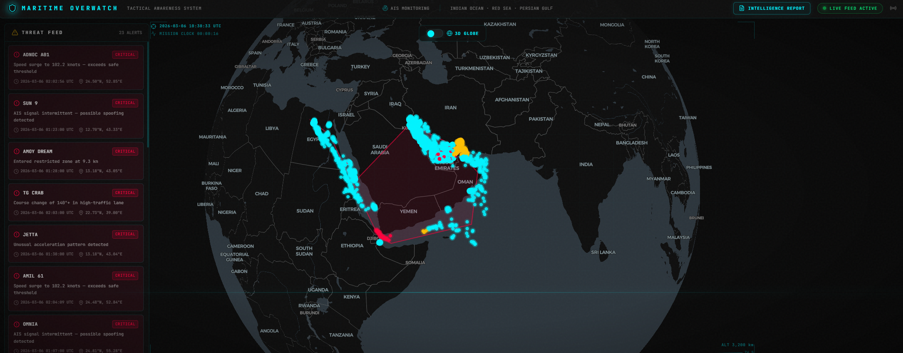
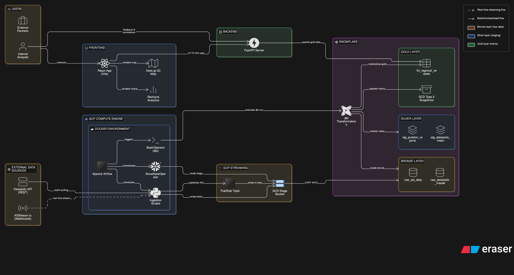
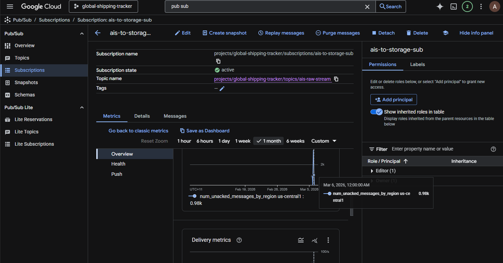
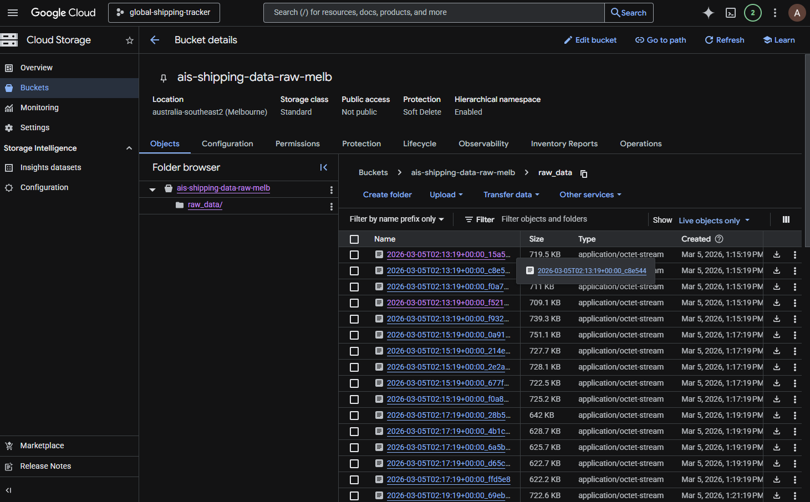
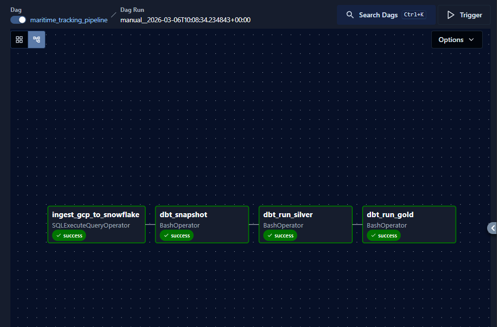
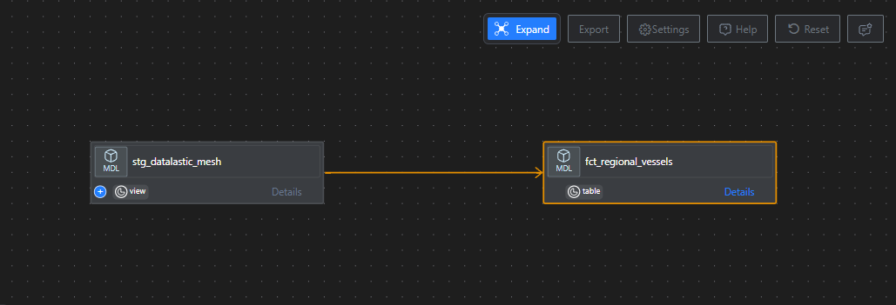
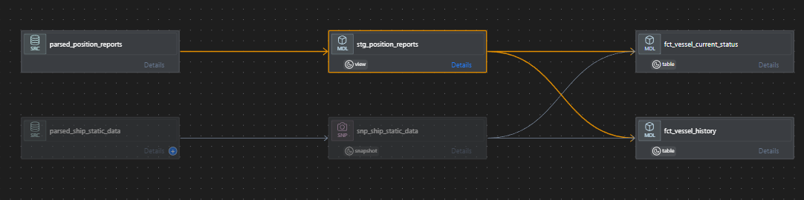
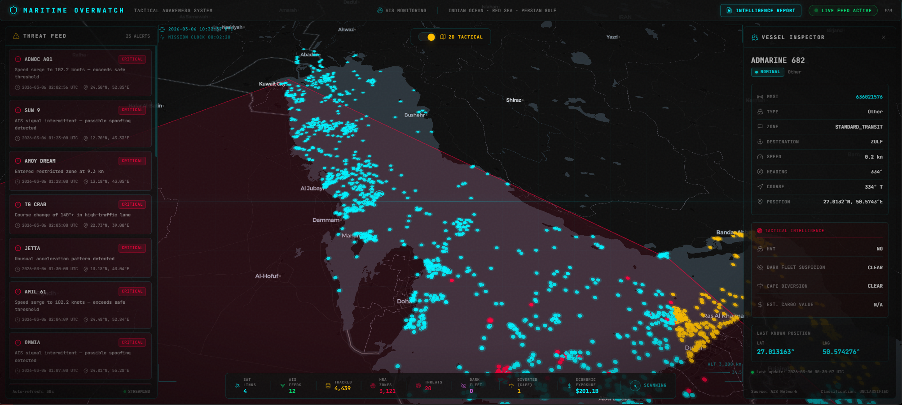
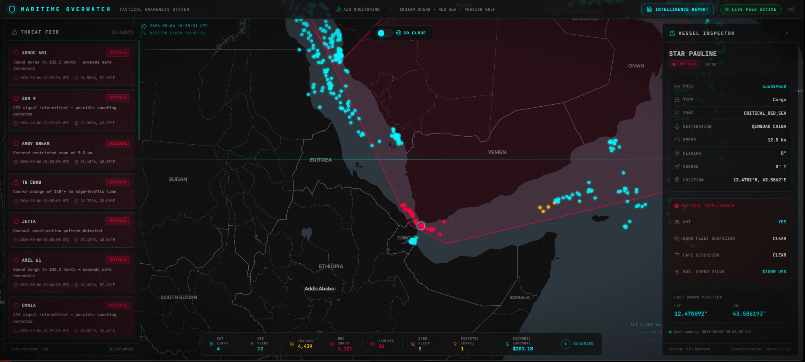
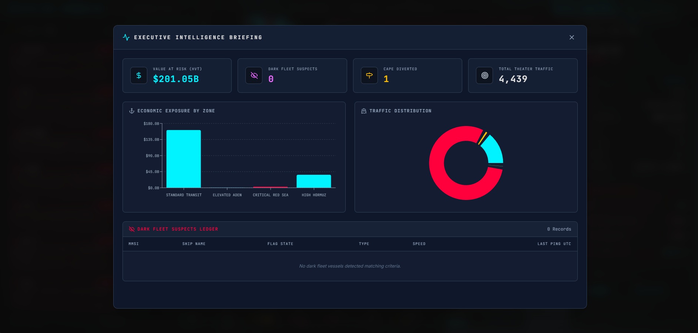

# 🌊 Sentinel: Maritime Geopolitical Intelligence Platform


---

## 📖 Executive Summary

**Sentinel** is an end-to-end data engineering platform designed to track, quantify, and visualize the impact of geopolitical conflicts on global maritime supply chains. 

While commercial tools like MarineTraffic focus on *logistics* (e.g., "When will this cargo arrive?"), Sentinel is built for *tactical intelligence and quantitative research*. By processing live **AIS (Automatic Identification System)** telemetry through a custom risk-scoring engine, this platform transforms raw geospatial data into actionable insights—detecting **dark fleet operations**, **supply chain diversions**, and real-time **Cargo Value at Risk (VaR)** across the Middle Eastern theater.



---

## 🎯 Problem Statement

### The Intelligence Gap in Maritime Security

The Red Sea crisis, driven by Houthi attacks on commercial shipping, has fundamentally disrupted global supply chains since late 2023. Insurance premiums have surged, major carriers have rerouted vessels around the Cape of Good Hope adding 10–14 days to journeys, and an estimated **$1 trillion** in annual trade flows through these contested waters.

Yet existing maritime tracking tools provide only **positional awareness** — answering the question *"Where is the ship?"* They lack the integrated intelligence to answer the far more critical operational questions:

* *"Which vessels are intentionally hiding by disabling their transponders?"*
* *"How many ships have abandoned the Suez Canal route this week?"*
* *"What is the total dollar value of cargo currently sitting inside active conflict zones?"*

Analysts and intelligence officers are forced to toggle between radar displays, weather maps, and spreadsheets to piece together fleet health. This fragmentation creates a **data blind spot**, making it difficult to distinguish between routine commercial activity and potential hostile evasion — leading to reactive rather than proactive decision-making.

---

## ✨ The Solution (Key Features)

Standard vessel trackers map coordinates. Sentinel engineers **context**. 

* 🕵️ **Dark Fleet Detection (Spoofing & Evasion)**
    * **The Logic:** Identifies vessels with a `speed_over_ground > 0.5 knots` but a telemetry ping older than 12 hours.
    * **The Value:** Highlights ships intentionally disabling transponders to evade drone strikes in the Red Sea or to obscure sanctioned oil transfers.

* 📉 **Supply Chain Alpha & Deviation Tracking**
    * **The Logic:** Flags vessels dynamically changing their destination to "Cape of Good Hope" or executing U-turns near the Bab el-Mandeb strait.
    * **The Value:** Acts as a leading indicator for supply chain shocks, tracking the exodus of global shipping away from the Suez Canal in real-time.

* 💰 **Dynamic Value at Risk (VaR)**
    * **The Logic:** Cross-references vessel type (e.g., Oil Tankers at ~$150M vs. Cargo Ships at ~$100M) with current geospatial boundaries to calculate the aggregate dollar value of cargo sitting in active conflict zones.
    * **The Value:** Provides quantitative researchers and stakeholders with a live ticker of exposed economic capital, per tactical zone.

* 🌐 **Programmatic Geospatial Mesh Sweeping**
    * **The Logic:** Circumvents standard API radius limits by programmatically deploying a mathematical grid of overlapping 50 NM "sonar buoys" across the entire Middle East, automatically deduplicating vessels by MMSI.
    * **The Value:** Achieves comprehensive theater coverage that single-point API calls cannot.

* 🔄 **SCD Type 2 Historical Tracking**
    * **The Logic:** Uses dbt Snapshots to implement Slowly Changing Dimension Type 2 on ship static data (destination, name, type), preserving a full audit trail of every change.
    * **The Value:** Detects when a vessel suspiciously changes its reported destination mid-voyage — a key indicator of route manipulation or sanction evasion.

---

## 🏗️ Architecture & Data Pipeline

Sentinel leverages a modern, decoupled **cloud data stack** following the ELT paradigm to ensure high throughput, fault tolerance, and analytical rigor.



---

### 1. Data Ingestion Layer — GCP (Extraction)

The entry point of the Sentinel platform is a robust extraction engine hosted on **Google Cloud Platform**. This layer interfaces with external third-party APIs and ensures the reliable delivery of raw AIS telemetry to our data lake.

#### Orchestration & Fault Tolerance

* **Google Cloud Compute Engine (VM):** A headless Linux instance hosts the Dockerized Apache Airflow environment (via Astro CLI), providing a highly available heartbeat for scheduling extraction workers.
* **Google Cloud Pub/Sub (The Shock Absorber):** When dealing with a volatile WebSocket stream like maritime AIS, you need a buffer. Instead of writing directly to a database thousands of times a minute, the Python extraction scripts act as lightweight "Publishers," instantly dropping raw JSON payloads into a Pub/Sub topic. This absorbs throughput spikes and ensures **zero data loss** even if the downstream storage momentarily hiccups.



#### Data Sources & Connectivity

| Source | Protocol | Data Payload |
|---|---|---|
| **AISStream** | WebSocket (Streaming) | Real-time position reports: MMSI, latitude, longitude, speed, heading, nav status |
| **Datalastic** | REST API (Batch) | Regional mesh sweep: IMO number, flag state, ship type, destination, ETA |

#### Landing Zone

* **Google Cloud Storage (GCS):** A subscriber pulls the buffered messages from Pub/Sub and writes them as newline-delimited JSON files into a GCS bucket (`ais_raw_gcs_stage`). This provides infinitely scalable, ultra-cheap object storage, acting as an immutable **Bronze data lake**. If the data warehouse is ever corrupted, historical JSON files can be fully replayed.



---

### 2. Orchestration Layer — Apache Airflow

The pipeline lifecycle is managed by **Apache Airflow**, deployed via the **Astro CLI** inside isolated Docker containers on our GCP Compute Engine VM.

A single Airflow DAG (`maritime_tracking_pipeline`) executes every **10 minutes**, running the following stages sequentially:

```
ingest_raw_data >> dbt_snapshot >> dbt_run_silver >> dbt_run_gold
```



#### DAG Task Breakdown

| # | Task ID | Operator | Description |
|---|---|---|---|
| 1 | `ingest_gcp_to_snowflake` | `SQLExecuteQueryOperator` | Executes `COPY INTO` from the GCS external stage into the Snowflake Bronze layer |
| 2 | `dbt_snapshot` | `BashOperator` | Runs `dbt snapshot` to capture SCD Type 2 changes in ship static data |
| 3 | `dbt_run_silver` | `BashOperator` | Runs `dbt run --select staging` to parse, clean, and validate raw JSON into the Silver layer |
| 4 | `dbt_run_gold` | `BashOperator` | Runs `dbt run --select marts` to execute the tactical intelligence engine and build the Gold layer |

```python
# The core ingestion task — loads raw JSON from GCS into Snowflake via COPY INTO
ingest_raw_data = SQLExecuteQueryOperator(
    task_id='ingest_gcp_to_snowflake',
    conn_id='snowflake_default',
    sql="""
        COPY INTO shipping.raw.raw_ais_data (raw_payload)
        FROM @shipping.public.ais_raw_gcs_stage
        FILE_FORMAT = (TYPE = JSON)
        ON_ERROR = 'CONTINUE';
    """
)
```

#### Why Astro CLI?

By running Airflow inside Docker containers managed by Astro, we achieve:
* **Environment parity** between local development and production
* **Dependency isolation** — dbt-snowflake, Snowflake providers, and Python scripts are pinned in `requirements.txt`
* **One-command deployment** — `astro dev start` spins up the webserver, scheduler, and metadata database

---

### 3. Data Warehouse — Snowflake

**Snowflake** is the analytical engine of the platform. Unlike traditional databases, Snowflake separates its **storage** layer from its **compute** layer (Virtual Warehouses), allowing independent scaling.

#### The ELT Paradigm

Raw, nested JSON is loaded directly into a single `VARIANT` column in the `RAW_AIS_DATA` table via Airflow's `COPY INTO` command. No parsing is done before loading. This is a critical architectural advantage:

* **Schema Evolution:** If AISStream or Datalastic changes their API payload (adding or removing fields), the ingestion pipeline will not break. New JSON structures simply load into the `VARIANT` column.
* **Full Replayability:** The raw data is preserved in its native format, providing an immutable audit trail.
* **Compute Isolation:** The dashboard's query warehouse is separate from the ETL warehouse, ensuring the frontend remains responsive during heavy batch loads.

---

### 4. Transformation Layer — dbt (Medallion Architecture)

Once raw data lands in Snowflake, the transformation responsibility shifts to **dbt (Data Build Tool)**. We implement a multi-hop **Medallion Architecture** to incrementally improve data quality, moving from raw inputs to business-level intelligence.



#### dbt Project Configuration

```yaml
# dbt_project.yml
models:
  shipping_tracker:
    staging:
      +materialized: view      # Lightweight, always-fresh reads
      +schema: silver           # Writes to the SILVER schema
    marts:
      +materialized: table      # Pre-computed for dashboard performance
      +schema: gold             # Writes to the GOLD schema
```

A custom `generate_schema_name` macro ensures dbt writes models directly to the `silver` and `gold` schemas without prepending the target schema — keeping the warehouse clean and predictable.

---

#### Bronze Layer (Raw)

| Table | Description |
|---|---|
| `raw_ais_data` | Raw `VARIANT` JSON payloads from the GCS external stage |
| `parsed_position_reports` | Pre-parsed AIS live position pings |
| `parsed_ship_static_data` | Pre-parsed static vessel metadata |
| `RAW_DATALASTIC_MASTER` | Raw JSON from the Datalastic mesh sweep |

---

#### Silver Layer (Staging — Cleaning & Validation)

Three staging models clean, cast, and validate the raw data:

**`stg_position_reports`** — Parses live AIS position pings:
```sql
select 
    mmsi,
    ship_name,
    try_to_timestamp_ntz(left(time_utc, 19)) as time_utc,
    latitude,
    longitude,
    speed_over_ground,
    course_over_ground,
    true_heading,
    nav_status
from raw_positions
where latitude is not null 
  and longitude is not null
```

**`stg_datalastic_mesh`** — Flattens the nested Datalastic JSON using Snowflake's native `:` semi-structured syntax:
```sql
select 
    raw_payload:mmsi::string as mmsi,
    raw_payload:imo::string as imo_number,
    raw_payload:name::string as ship_name,
    raw_payload:country_iso::string as flag_state,
    raw_payload:type::string as ship_type,
    raw_payload:destination::string as destination,
    raw_payload:lat::float as latitude,
    raw_payload:lon::float as longitude,
    raw_payload:speed::float as speed_over_ground,
    raw_payload:last_position_UTC::timestamp_ntz as time_utc
from raw_mesh_data
where raw_payload:lat is not null 
  and raw_payload:lon is not null
```

**`stg_ship_static_data`** — Standardizes vessel metadata with `TRIM()` and null filtering.

---

#### SCD Type 2 Snapshot

The `snp_ship_static_data` snapshot implements **Slowly Changing Dimension Type 2** on ship static data using dbt's `check` strategy. It monitors changes in `destination`, `ship_name`, and `ship_type` — whenever a vessel's reported destination changes, a new historical record is created and the old one is closed:

```sql

{{
    config(
      target_schema='snapshots',
      unique_key='mmsi',
      strategy='check',
      check_cols=['destination', 'ship_name', 'ship_type']
    )
}}
select mmsi, trim(ship_name) as ship_name, trim(destination) as destination,
       ship_type, dimension_to_bow, dimension_to_stern
from {{ source('raw_shipping_data', 'parsed_ship_static_data') }}
where mmsi is not null
qualify row_number() over (partition by mmsi order by ship_name, destination) = 1

```

This enables downstream models like `fct_vessel_current_status` to join against only the **currently active** record (`WHERE dbt_valid_to IS NULL`).



---

#### Gold Layer (Marts — Tactical Intelligence Engine)

This is where raw data becomes **intelligence**. Three fact tables power the serving layer:

##### `fct_regional_vessels` — The Core Intelligence Table

The flagship mart that fuses Datalastic mesh data with five proprietary intelligence features:

```sql
-- Feature 1: Dynamic Conflict Zone Tagging
-- Draws invisible geospatial bounding boxes to assign risk levels
case
    when latitude between 12.0 and 16.0 
     and longitude between 41.0 and 45.0 then 'CRITICAL_RED_SEA'
    when latitude between 25.0 and 27.5 
     and longitude between 55.0 and 57.5 then 'HIGH_HORMUZ'
    when latitude between 11.0 and 15.0 
     and longitude between 45.0 and 51.0 then 'ELEVATED_ADEN'
    else 'STANDARD_TRANSIT'
end as tactical_zone,

-- Feature 2: High-Value Target (HVT) Identification
case when ship_type in ('Tanker', 'Cargo') then TRUE else FALSE
end as is_high_value_target,

-- Feature 3: Dark Fleet Suspicion
case when speed_over_ground > 0.5 
      and datediff('hour', time_utc, current_timestamp()) > 12 then TRUE
     else FALSE
end as dark_fleet_suspicion,

-- Feature 4: Diverted via Cape of Good Hope
case when upper(destination) like '%CAPE%' 
       or upper(destination) like '%CGH%' 
       or upper(destination) like '%HOPE%' then TRUE
     else FALSE
end as is_diverted_cape,

-- Feature 5: Estimated Cargo Value (USD)
case when ship_type = 'Tanker' then 150000000
     when ship_type = 'Cargo' then 100000000
     else 0
end as estimated_cargo_value_usd
```

The model also employs advanced deduplication:
```sql
qualify row_number() over (partition by mmsi order by time_utc desc) = 1
```
This ensures the map only displays the **absolute latest ping** for every unique ship — no ghost echoes or stale data.

##### `fct_vessel_current_status`

Joins the latest position ping with the active SCD2 snapshot record to produce a unified vessel profile:
* Deduplicates positions via `ROW_NUMBER() OVER (PARTITION BY mmsi ORDER BY time_utc DESC)`
* Joins against `snp_ship_static_data WHERE dbt_valid_to IS NULL` for current metadata
* Powers the vessel inspector panel on the dashboard

##### `fct_vessel_history`

Preserves the full positional timeline for every vessel, enabling historical track analysis and replay features. Joins all position reports with the current active static data record.

---

### 5. Serving Layer — FastAPI Backend

A high-performance **FastAPI** server bridges the gap between the Snowflake Gold layer and the React frontend. It acts as a secure proxy — Snowflake credentials never leave the backend.

#### API Endpoints

| Method | Endpoint | Description |
|---|---|---|
| `GET` | `/api/vessels/live` | Returns all vessels in the theater — feeds the Deck.gl map |
| `GET` | `/api/vessels/zone/{zone_name}` | Filters vessels by tactical zone (`CRITICAL_RED_SEA`, `HIGH_HORMUZ`, etc.) |
| `GET` | `/api/vessels/hvt` | Returns all High-Value Targets (Tankers + Cargo) |
| `GET` | `/api/intelligence/summary` | Aggregate vessel counts per tactical zone — feeds the HUD |
| `GET` | `/api/intelligence/dark-fleet` | Returns all vessels flagged as dark fleet |
| `GET` | `/api/intelligence/diverted-vessels` | Returns Cape-of-Good-Hope diversion detections |
| `GET` | `/api/intelligence/economic-exposure` | Aggregate cargo VaR by tactical zone |
| `GET` | `/health` | Health check with live Snowflake connectivity test |

#### Connection Management

Each API request opens a dedicated Snowflake connection via a FastAPI dependency injection (`Depends(get_snowflake_connection)`), automatically configured with login/network timeouts and guaranteed cleanup via a `finally` block.

#### Date Serialization

A custom `rows_to_dicts` helper serializes all `datetime` and `date` objects to ISO 8601 strings, ensuring seamless JSON compatibility with the JavaScript frontend.

---

### 6. Presentation Layer — React Dashboard (Sentinel Command Center)

The final layer is the **Operational Intelligence Console** — a Palantir-inspired dark-mode UI built with **React 19**, **Next.js 16**, **Deck.gl 9**, **MapLibre GL**, and **Tailwind CSS 4**. It is not a passive visualization; it is an active decision-support tool designed for maritime analysts.



#### Key Interface Modules

##### 1. Global Map View (Geospatial Intelligence)
* **Tech:** Powered by **Deck.gl** for rendering tens of thousands of dynamic 3D geospatial points without frame drops, layered on top of **MapLibre GL** base tiles.
* **Function:** Visualizes the real-time position of the entire fleet. Vessels are dynamically color-coded based on the tactical intelligence layer — **Red** for critical (Red Sea conflict zone), **Amber** for elevated (Hormuz, Aden), and **Green** for standard transit.

##### 2. Alert Feed (Anomaly Detection)
* **Function:** Automatically generates anomaly alerts from the live vessel data. Critical alerts (speed surges, AIS spoofing, restricted zone entry) bubble to the top.
* **Logic:** Anomalies are derived client-side from the vessel status data (`critical`, `warning`, `info`), sorted by severity for immediate operator attention.

##### 3. Vessel Inspector (Drill-Down Telemetry)
* **Function:** When a specific vessel is selected on the map, a slide-out panel reveals detailed intelligence:
    * **Positional Data:** MMSI, speed, heading, coordinates
    * **Classification:** Ship type, flag state, destination, ETA
    * **Threat Assessment:** Tactical zone, dark fleet flag, diversion status, estimated cargo value

##### 4. Tactical Overlay (Heads-Up Display)
* **Function:** A persistent HUD displaying real-time fleet statistics: total vessels tracked, active threat count, and zone-level summaries — providing instant situational awareness at a glance.

##### 5. Conflict Insights Panel
* **Function:** Contextual geopolitical intelligence with zone-by-zone breakdowns, providing macro-level operational awareness alongside the micro-level vessel data.

##### 6. Intelligence Briefing Modal
* **Function:** A comprehensive full-screen EDA (Exploratory Data Analysis) view powered by **Recharts**, presenting aggregate fleet analytics, threat distribution charts, and economic exposure summaries.





---

## 📂 Project Structure

```
Sentinel/
├── assets/                        # Screenshots & architecture diagrams
│   ├── architecture.png               # End-to-end pipeline diagram
│   ├── airflow_dag.png                # Airflow DAG screenshot
│   ├── dbt_lineage_*.png              # dbt lineage graphs
│   ├── gcp_pub_sub.png                # GCP Pub/Sub console
│   ├── gcp_raw_data_bucket.png        # GCS raw data bucket
│   ├── globe_view.png                 # 3D globe dashboard view
│   ├── persiaan_gulf_2d.png           # 2D tactical map view
│   ├── red_sea_crossing.png           # Red Sea conflict zone view
│   └── intelligence_report_*.png      # Intelligence dashboard
│
├── ais_airflow/                   # Airflow + dbt (The Brain)
│   ├── dags/
│   │   └── maritime_pipeline.py       # Core DAG: ingest → snapshot → silver → gold
│   ├── shipping_tracker/              # dbt Project
│   │   ├── models/
│   │   │   ├── staging/               # Silver Layer (views)
│   │   │   │   ├── sources.yml            # Source definitions (Bronze tables)
│   │   │   │   ├── stg_position_reports.sql
│   │   │   │   ├── stg_datalastic_mesh.sql
│   │   │   │   └── stg_ship_static_data.sql
│   │   │   └── marts/                 # Gold Layer (tables)
│   │   │       ├── fct_regional_vessels.sql       # Core intelligence table
│   │   │       ├── fct_vessel_current_status.sql  # Latest position + SCD2
│   │   │       └── fct_vessel_history.sql         # Full positional timeline
│   │   ├── snapshots/
│   │   │   └── snp_ship_static_data.sql   # SCD Type 2 snapshot
│   │   ├── macros/
│   │   │   └── generate_schema_name.sql   # Custom schema routing
│   │   ├── dbt_project.yml
│   │   └── profiles.yml
│   ├── Dockerfile                 # Astro Runtime image
│   └── requirements.txt          # Python deps (dbt-snowflake, etc.)
│
├── dashboard/                     # React Frontend (The Face)
│   ├── src/
│   │   ├── app/
│   │   │   ├── page.tsx               # Main application orchestrator
│   │   │   ├── layout.tsx             # Root layout with metadata
│   │   │   └── globals.css            # Design system (dark theme tokens)
│   │   ├── components/
│   │   │   ├── map-view.tsx           # Deck.gl + MapLibre geospatial renderer
│   │   │   ├── header.tsx             # Top navigation + branding
│   │   │   ├── alert-feed.tsx         # Real-time anomaly ticker
│   │   │   ├── vessel-inspector.tsx   # Drill-down vessel details panel
│   │   │   ├── tactical-overlay.tsx   # Persistent HUD statistics
│   │   │   ├── conflict-insights.tsx  # Zone-level intelligence panel
│   │   │   └── intelligence-modal.tsx # Full-screen EDA briefing
│   │   └── lib/
│   │       └── mock-data.ts           # API client + type definitions
│   └── package.json
│
├── main.py                        # FastAPI Backend (The Bridge)
├── pyproject.toml                 # Python project & dependencies
├── .env                           # Snowflake credentials (*not committed*)
└── README.md                      # You are here
```

### Component Breakdown

* **`ais_airflow/`**: The pipeline brain. Contains both the Airflow DAG that orchestrates the 10-minute ingestion cycle and the full dbt project that transforms raw JSON into tactical intelligence via the Medallion Architecture.
* **`dashboard/`**: The reactive frontend. Fetches live data from the FastAPI backend and renders it onto an interactive geospatial map with Deck.gl, providing the final visual layer for analysts.
* **`main.py`**: The secure gateway. Holds Snowflake credentials in environment variables and exposes 8 RESTful API endpoints querying the Gold layer directly.

---

## 🔧 Tech Stack Summary

| Layer | Technology | Purpose |
|---|---|---|
| **Ingestion** | GCP Compute Engine | Hosts Airflow + extraction scripts |
| **Buffering** | GCP Pub/Sub | Zero-loss message queue for AIS streams |
| **Data Lake** | GCP Cloud Storage | Immutable raw JSON archive |
| **Orchestration** | Apache Airflow (Astro CLI) | Schedules and sequences the full pipeline |
| **Warehouse** | Snowflake | Columnar analytics with `VARIANT` semi-structured support |
| **Transformation** | dbt | SQL-based Medallion Architecture (Bronze → Silver → Gold) |
| **Backend API** | FastAPI + `snowflake-connector-python` | Secure REST API serving the Gold layer |
| **Frontend** | React 19 + Next.js 16 | Server-side rendering + client-side interactivity |
| **Visualization** | Deck.gl 9 + MapLibre GL | High-performance 3D geospatial rendering |
| **Styling** | Tailwind CSS 4 | Palantir-inspired dark-mode design system |
| **Charts** | Recharts | EDA analytics and distribution visualizations |
| **Containerization** | Docker (Astro) | Isolated, reproducible Airflow environments |

---

## ⚙️ Local Development Setup

### Prerequisites
* **Docker** & **Astro CLI** (for Airflow)
* **Python 3.13+** (for the FastAPI backend)
* **Node.js 18+** & **npm** (for the React dashboard)
* **Snowflake Account** with a configured warehouse
* **GCP Service Account** with access to Cloud Storage & Pub/Sub

### 1. Clone the Repository

```bash
git clone https://github.com/AvirukthGT/Marine-AIS-Tracker.git
cd Marine-AIS-Tracker
```

### 2. Start the Airflow / Data Pipeline

```bash
cd ais_airflow

# Start the Astro/Airflow cluster (webserver, scheduler, metadata DB)
astro dev start
```

The Airflow UI will be available at `http://localhost:8080`. Enable the `maritime_tracking_pipeline` DAG to begin automatic 10-minute ingestion cycles.

### 3. Start the FastAPI Backend

```bash
# From the project root
# Create a .env file with your Snowflake credentials:
# SNOWFLAKE_ACCOUNT=your_account
# SNOWFLAKE_USER=your_user
# SNOWFLAKE_PASSWORD=your_password
# SNOWFLAKE_DATABASE=SHIPPING
# SNOWFLAKE_SCHEMA=GOLD
# SNOWFLAKE_WAREHOUSE=your_warehouse

# Install dependencies and start the server
uv run uvicorn main:app --reload --port 8000
```

The API will be live at `http://localhost:8000`. Verify connectivity at `http://localhost:8000/health`.

### 4. Start the React Frontend

```bash
cd dashboard

# Install dependencies
npm install

# Start the development server
npm run dev
```

The Sentinel Command Center will be live at `http://localhost:3000`.

---

## 🚀 Future Roadmap

* **Agentic RAG Integration:** Implementing LangGraph to allow users to query the Snowflake database via natural language (e.g., *"How many UK-flagged vessels are currently inside the Red Sea critical zone?"*).
* **Historical Playback:** Adding Deck.gl `TripLayer` capabilities to animate the exact deviation paths of vessels over a 14-day rolling window.
* **Predictive Threat Scoring:** Integrating an ML model to predict vessel risk scores based on historical behavior patterns, flag state, and route anomalies.
* **Real-time Streaming:** Migrating from batch-polling to true real-time event processing via Snowpipe Streaming for sub-minute latency.

---

## 👨‍💻 Connect with Me

I am a Data Engineer passionate about building scalable cloud data architectures and alternative data pipelines.

* **LinkedIn:** [Avirukth Thadaklur](https://www.linkedin.com/in/avirukth-thadaklur)
* **GitHub:** [AvirukthGT](https://github.com/AvirukthGT)

---

*Built as a showcase of modern Data Engineering, Geospatial Analytics, and Alternative Data processing.*
